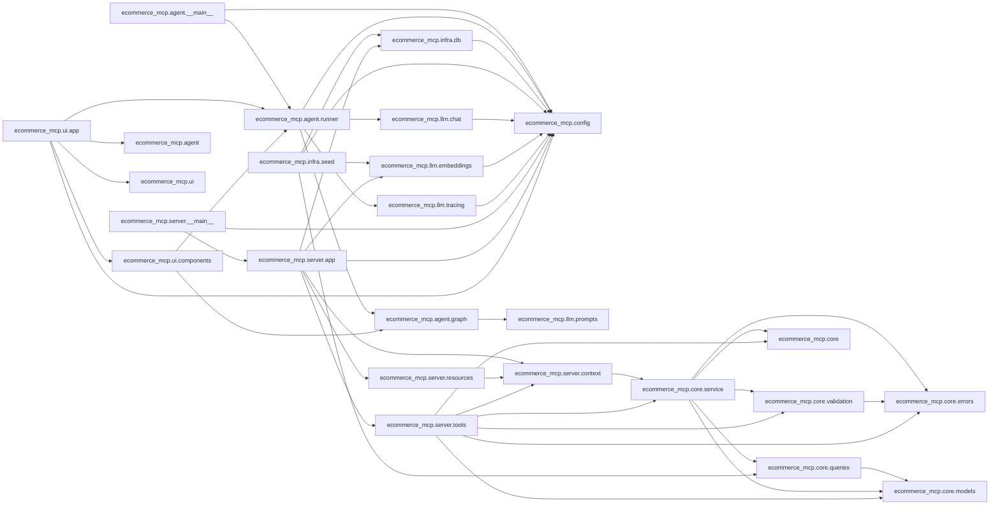

# Code map

Generated by `scripts/code_map.py`. Do not edit by hand.

```mermaid
graph LR
    ecommerce_mcp.agent.__main__ --> ecommerce_mcp.agent.runner
    ecommerce_mcp.agent.__main__ --> ecommerce_mcp.config
    ecommerce_mcp.agent.graph --> ecommerce_mcp.llm.prompts
    ecommerce_mcp.agent.runner --> ecommerce_mcp.agent.graph
    ecommerce_mcp.agent.runner --> ecommerce_mcp.config
    ecommerce_mcp.agent.runner --> ecommerce_mcp.llm.chat
    ecommerce_mcp.agent.runner --> ecommerce_mcp.llm.tracing
    ecommerce_mcp.core.queries --> ecommerce_mcp.core.models
    ecommerce_mcp.core.service --> ecommerce_mcp.core
    ecommerce_mcp.core.service --> ecommerce_mcp.core.errors
    ecommerce_mcp.core.service --> ecommerce_mcp.core.models
    ecommerce_mcp.core.service --> ecommerce_mcp.core.queries
    ecommerce_mcp.core.service --> ecommerce_mcp.core.validation
    ecommerce_mcp.core.validation --> ecommerce_mcp.core.errors
    ecommerce_mcp.infra.db --> ecommerce_mcp.config
    ecommerce_mcp.infra.seed --> ecommerce_mcp.config
    ecommerce_mcp.infra.seed --> ecommerce_mcp.core.queries
    ecommerce_mcp.infra.seed --> ecommerce_mcp.infra.db
    ecommerce_mcp.infra.seed --> ecommerce_mcp.llm.embeddings
    ecommerce_mcp.llm.chat --> ecommerce_mcp.config
    ecommerce_mcp.llm.embeddings --> ecommerce_mcp.config
    ecommerce_mcp.llm.tracing --> ecommerce_mcp.config
    ecommerce_mcp.server.__main__ --> ecommerce_mcp.config
    ecommerce_mcp.server.__main__ --> ecommerce_mcp.server.app
    ecommerce_mcp.server.app --> ecommerce_mcp.config
    ecommerce_mcp.server.app --> ecommerce_mcp.infra.db
    ecommerce_mcp.server.app --> ecommerce_mcp.llm.embeddings
    ecommerce_mcp.server.app --> ecommerce_mcp.server.context
    ecommerce_mcp.server.app --> ecommerce_mcp.server.resources
    ecommerce_mcp.server.app --> ecommerce_mcp.server.tools
    ecommerce_mcp.server.context --> ecommerce_mcp.core.service
    ecommerce_mcp.server.resources --> ecommerce_mcp.server.context
    ecommerce_mcp.server.tools --> ecommerce_mcp.core
    ecommerce_mcp.server.tools --> ecommerce_mcp.core.errors
    ecommerce_mcp.server.tools --> ecommerce_mcp.core.models
    ecommerce_mcp.server.tools --> ecommerce_mcp.core.service
    ecommerce_mcp.server.tools --> ecommerce_mcp.core.validation
    ecommerce_mcp.server.tools --> ecommerce_mcp.server.context
    ecommerce_mcp.ui.app --> ecommerce_mcp.agent
    ecommerce_mcp.ui.app --> ecommerce_mcp.agent.runner
    ecommerce_mcp.ui.app --> ecommerce_mcp.config
    ecommerce_mcp.ui.app --> ecommerce_mcp.ui
    ecommerce_mcp.ui.app --> ecommerce_mcp.ui.components
    ecommerce_mcp.ui.components --> ecommerce_mcp.agent.graph
    ecommerce_mcp.ui.components --> ecommerce_mcp.agent.runner
```

## Modules not imported by any other module

- none
